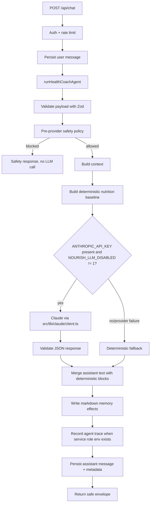

# AI-CHAT-01 Architecture Note — Health Coach Agent Harness

Status: implemented foundation slice, with deterministic fallback always available and real LLM execution enabled when server-side Anthropic configuration is present.

## 1. What exists today

Nourish is a Next.js App Router PWA with Supabase Auth, Supabase Postgres, TypeScript, Tailwind CSS, Vitest, Playwright, Anthropic SDK, prompt markdown files, and layered memory tables.

Relevant existing pieces before AI-CHAT-01:

- `src/app/api/chat/route.ts` authenticated users, rate-limited chat requests, persisted user/assistant messages in `public.messages`, and returned safe response envelopes.
- `src/lib/agents/orchestrator.ts` routed chat text through deterministic meal-log parsing and nutrition estimation.
- `src/lib/nutrition/pipeline.ts` and `src/lib/safety/check.ts` produced deterministic meal estimates and allergy/condition safety flags.
- `public.memories` stored markdown-backed layered memory (`profile`, `patterns`, `context`, `semantic`, `daily`, `weekly`, `monthly`) with audit snapshots.
- `public.agent_traces` existed for LLM observability, but the chat path did not yet record health-coach traces.
- `prompts/agents/*.md` held role prompts for router, coach, nutrition estimator, onboarding parser, memory consolidator, nudges, and safety rules.
- `src/lib/evals/prompt-evals.ts` provided a prompt/eval harness for router, nutrition, coach, onboarding, and safety contracts.

## 2. What AI-CHAT-01 added

AI-CHAT-01 adds a health-coach runtime under `src/lib/agents/health-coach/`:

- `runtime.ts` — request lifecycle orchestration.
- `llmProvider.ts` — provider selection and Anthropic-backed generation when configured.
- `deterministicFallback.ts` — the existing deterministic meal estimator preserved as the safe fallback.
- `promptRegistry.ts` — prompt assembly from `HEALTH_COACH`, `SAFETY_RULES`, `COACH`, retrieved context, and deterministic baseline output.
- `contextBuilder.ts` — retrieval of user row, structured profile, markdown memory, and recent confirmed meals.
- `memoryWriter.ts` — markdown memory effects for daily continuity and stable/tentative preference facts.
- `safetyPolicy.ts` — high-priority pre-provider blocks for self-harm, medical/prescription requests, and unsafe restriction.
- `responseQuality.ts` — strict JSON parsing, inferred fact validation, and lightweight user-message fact extraction.
- `traceLogger.ts` — service-role-only trace logging into `agent_traces` when server env vars are available.

It also adds `prompts/agents/HEALTH_COACH.md`, updates the orchestrator to call the health-coach runtime, and extends prompt evals with an `health-coach-runtime` suite.

## 3. Agent request lifecycle



The LLM is allowed to improve the coaching language, assumptions, and memory inferences. Numeric meal estimates and confirm-save payloads continue to come from deterministic tools so the app does not invent calories/macros.

## 4. Memory storage and retrieval

### Retrieval

For each request, `contextBuilder` attempts to retrieve:

- `users`: display name, timezone, estimation preference, nudge tone.
- `user_profiles`: structured safety and personalization fields such as allergies, conditions, dietary pattern, goal, city, and targets.
- `memories`: recent markdown memory rows across profile, patterns, context, semantic, daily, weekly, and monthly layers.
- `meals`: recent confirmed meals from the last seven days.

If Supabase context is unavailable, the runtime still works with deterministic fallback and records a context warning in metadata.

### Writing

`memoryWriter` writes only safe, limited markdown effects:

- appends a daily turn summary into `memories/daily/<YYYY-MM-DD>`;
- promotes stable or preference-like facts into `memories/patterns/main`;
- de-duplicates identical lines;
- never writes hidden prompts, raw provider payloads, secrets, or medical diagnoses as stable facts.

The existing Profile memory inspector remains the user-facing correction/deletion surface for markdown memory.

## 5. Eval and test harness

AI-CHAT-01 extends the prompt eval suite with `health-coach-runtime` cases:

- the health-coach prompt must require JSON output, inspectable memory behavior, and deterministic nutrition baselines;
- chat must fall back deterministically when no provider is configured;
- unsafe medical/prescription requests must be blocked before provider execution.

Run evals with:

```bash
pnpm run eval:prompts
```

Focused implementation tests:

```bash
pnpm run test -- src/lib/agents/orchestrator.test.ts src/lib/agents/health-coach/runtime.test.ts src/app/api/chat/route.test.ts src/lib/evals/prompt-evals.test.ts
```

## 6. Environment variables

Server-side LLM execution requires:

- `ANTHROPIC_API_KEY` — server-only Anthropic API key.
- `ANTHROPIC_HEALTH_COACH_MODEL` — optional model override, defaulting to `claude-3-5-haiku-latest`.
- `NOURISH_LLM_DISABLED=1` — optional kill switch that forces deterministic fallback.

Trace logging into `agent_traces` requires the existing server-only Supabase service role configuration:

- `NEXT_PUBLIC_SUPABASE_URL`
- `SUPABASE_SERVICE_ROLE_KEY`

## 7. Intentionally out of scope

This slice does not implement:

- voice-to-text provider integration;
- photo/file meal logging;
- proactive check-ins;
- weekly review generation;
- user feedback capture UI;
- LLM-driven tool execution beyond structured health-coach drafting;
- model streaming;
- vector/RAG infrastructure.

Those should build on this runtime rather than bypass it.
