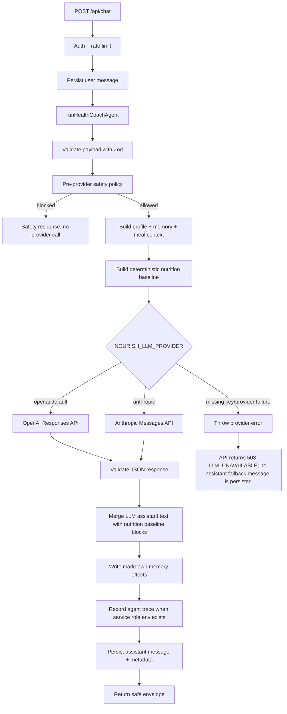

# AI-CHAT-01B Architecture Note — Health Coach LLM Provider Harness

Status: implemented foundation slice. The health coach now requires a configured LLM provider for normal chat, defaults to OpenAI, can be switched to Anthropic, and no longer returns deterministic/template assistant fallback text when the provider is missing or failing.

## 1. What exists today

Nourish is a Next.js App Router PWA with Supabase Auth, Supabase Postgres, TypeScript, Tailwind CSS, Vitest, Playwright, prompt markdown files, and layered memory tables.

Relevant pieces before AI-CHAT-01B:

- `src/app/api/chat/route.ts` authenticates users, rate-limits chat requests, persists user/assistant messages in `public.messages`, and returns safe response envelopes.
- `src/lib/agents/orchestrator.ts` delegates chat text into the health-coach runtime.
- `src/lib/nutrition/pipeline.ts` and `src/lib/safety/check.ts` produce deterministic meal estimates and allergy/condition safety flags.
- `public.memories` stores markdown-backed layered memory (`profile`, `patterns`, `context`, `semantic`, `daily`, `weekly`, `monthly`) with audit snapshots.
- `public.agent_traces` stores LLM observability metadata when service-role env vars are available.
- `prompts/agents/*.md` holds role prompts for router, coach, nutrition estimator, onboarding parser, memory consolidator, nudges, and safety rules.
- `src/lib/evals/prompt-evals.ts` provides prompt/eval coverage for router, nutrition, coach, onboarding, health-coach runtime, and safety contracts.

## 2. What AI-CHAT-01B added/changed

AI-CHAT-01B updates the health-coach runtime under `src/lib/agents/health-coach/`:

- `runtime.ts` — fails closed with `HealthCoachProviderError` when the selected provider is missing or fails, rather than returning template assistant text.
- `llmProvider.ts` — selects `openai` or `anthropic` from `NOURISH_LLM_PROVIDER`, defaults to OpenAI, and routes through provider-specific client helpers.
- `src/lib/openai/client.ts` — server-side OpenAI Responses API helper using `OPENAI_API_KEY`.
- `src/lib/claude/client.ts` — existing server-side Anthropic Messages helper using `ANTHROPIC_API_KEY`.
- `deterministicFallback.ts` — retained as an internal nutrition baseline/tool output only; it is not a user-visible no-key chatbot fallback.
- `promptRegistry.ts` — prompt assembly from `HEALTH_COACH`, `SAFETY_RULES`, `COACH`, retrieved context, and deterministic nutrition baseline output.
- `contextBuilder.ts` — retrieval of user row, structured profile, markdown memory, and recent confirmed meals.
- `memoryWriter.ts` — markdown memory effects for daily continuity and stable/tentative preference facts.
- `safetyPolicy.ts` — high-priority pre-provider blocks for self-harm, medical/prescription requests, and unsafe restriction.
- `responseQuality.ts` — strict JSON parsing, inferred fact validation, and lightweight user-message fact extraction.
- `traceLogger.ts` — service-role-only trace logging into `agent_traces` when server env vars are available.

## 3. Agent request lifecycle



The LLM owns normal chatbot wording, coaching tone, and memory inferences. Numeric meal estimates and confirm-save payloads continue to come from deterministic tools so the model cannot invent calories/macros.

## 4. Memory storage and retrieval

### Retrieval

For each request, `contextBuilder` attempts to retrieve:

- `users`: display name, timezone, estimation preference, nudge tone.
- `user_profiles`: structured safety and personalization fields such as allergies, conditions, dietary pattern, goal, city, and targets.
- `memories`: recent markdown memory rows across profile, patterns, context, semantic, daily, weekly, and monthly layers.
- `meals`: recent confirmed meals from the last seven days.

If Supabase context is unavailable, the runtime can still call the selected LLM with an empty/context-warning payload. It does not use context failure as permission to produce a deterministic chatbot fallback.

### Writing

`memoryWriter` writes only safe, limited markdown effects:

- appends a daily turn summary into `memories/daily/<YYYY-MM-DD>`;
- promotes stable or preference-like facts into `memories/patterns/main`;
- de-duplicates identical lines;
- never writes hidden prompts, raw provider payloads, secrets, or medical diagnoses as stable facts.

The existing Profile memory inspector remains the user-facing correction/deletion surface for markdown memory.

## 5. Eval and test harness

AI-CHAT-01B keeps the `health-coach-runtime` prompt eval suite and updates it for LLM-required behavior:

- the health-coach prompt must require JSON output, inspectable memory behavior, and deterministic nutrition baselines;
- chat must fail closed when the selected provider key is missing;
- non-meal chat must route to an LLM coach response rather than template fallback guidance;
- unsafe medical/prescription requests must be blocked before provider execution.

Run evals with:

```bash
pnpm run eval:prompts
```

Focused implementation tests:

```bash
pnpm run test -- src/lib/agents/orchestrator.test.ts src/lib/agents/health-coach/runtime.test.ts src/app/api/chat/route.test.ts src/lib/evals/prompt-evals.test.ts
```

## 6. Environment variables

Server-side LLM execution requires one selected provider and its matching server-only API key:

- `NOURISH_LLM_PROVIDER=openai` — default/provider preference for MVP.
- `OPENAI_API_KEY` — server-only OpenAI API key. Required when provider is `openai`.
- `OPENAI_HEALTH_COACH_MODEL` — optional OpenAI model override, defaulting to `gpt-5.2`.
- `NOURISH_LLM_PROVIDER=anthropic` — optional provider switch.
- `ANTHROPIC_API_KEY` — server-only Anthropic API key. Required when provider is `anthropic`.
- `ANTHROPIC_HEALTH_COACH_MODEL` — optional Anthropic model override, defaulting to `claude-3-5-haiku-latest`.

There is intentionally no deterministic chatbot kill switch. If the selected provider key is absent or invalid, `/api/chat` returns `503 LLM_UNAVAILABLE` after saving the user message, and no assistant fallback message is persisted. The OpenAI provider asks the Responses API for Structured Outputs with the health-coach JSON schema so app-side parsing failures are less likely than prompt-only JSON instructions.

Authenticated operators can inspect the deployed provider configuration at `/api/health/llm` and run a tiny live provider smoke test at `/api/health/llm?check=1`. The endpoint reports provider, model, key-presence, reason codes, and latency only; it never returns API keys and does not write chat messages. Server env reads tolerate the common Vercel mistake of pasting `NAME=value` into the value field by stripping a matching `NAME=` prefix before provider/key/model resolution.

Trace logging into `agent_traces` requires the existing server-only Supabase service role configuration:

- `NEXT_PUBLIC_SUPABASE_URL`
- `SUPABASE_SERVICE_ROLE_KEY`

## 7. Intentionally out of scope

This slice does not implement:

- voice-to-text provider integration;
- photo/file meal logging;
- proactive check-ins;
- weekly review generation;
- user feedback capture UI;
- LLM-driven tool execution beyond structured health-coach drafting;
- model streaming;
- vector/RAG infrastructure.

Those should build on this runtime rather than bypass it.
