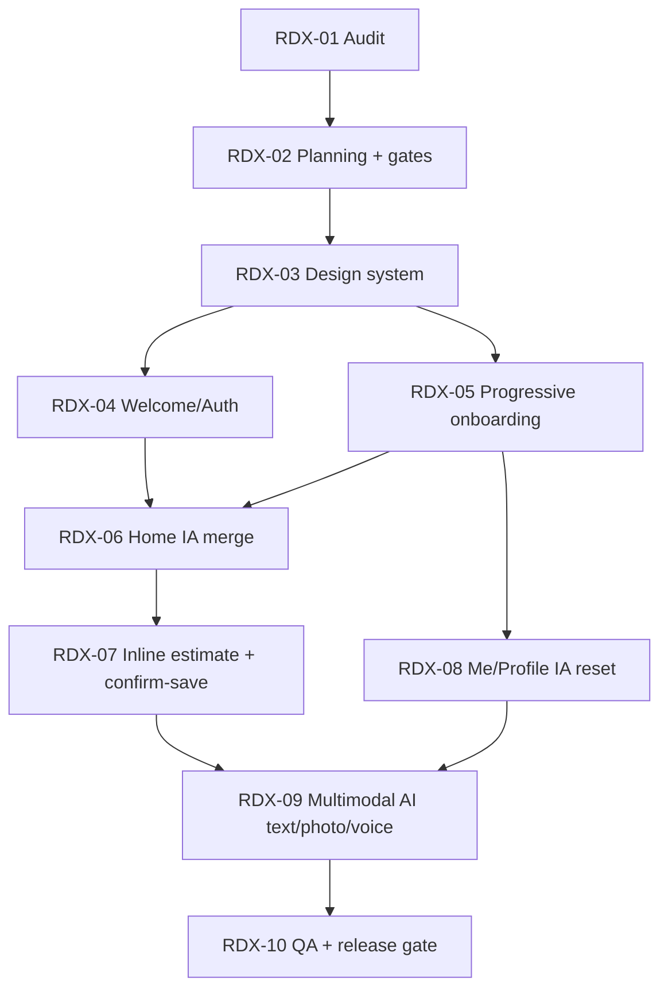

# Nourish MVP Redesign + Multimodal Plan (Execution Draft)

_Last updated: 2026-05-22_

## 1) What this plan is solving

This plan converts the redesign brief into a sequence that can ship safely without stalling the current MVP track:

1. **Product reset:** calm premium UX, no internal/debug language in user flows.
2. **Core loop quality:** merged Home + chat + confirm-save meal estimate.
3. **Multimodal logging:** text first, then photo + voice (speech-to-text), with feature flags.
4. **Trust + safety:** health-safe language, confirmation before save, privacy controls preserved.
5. **Release discipline:** each phase testable in local + Vercel preview before merge.

## 2) Scope guardrails

### In scope
- Design token hardening and reusable component cleanup.
- Welcome/auth redesign.
- Progressive onboarding replacing fake-chat onboarding pattern.
- Home merge (Chat + Today summary).
- Inline estimate + confirm-save flow.
- Me/Profile user-first IA cleanup.
- Text + photo + voice intake scaffolding and server-side AI contract.
- Prompt/system-context structure for personalized coaching.
- QA pass for mobile viewports + accessibility basics.

### Out of scope for this execution window
- New provider migrations (auth/DB replacement).
- Full native mobile app rewrite.
- Wearables/integrations beyond current MVP boundaries.
- Non-essential visual polish that risks timeline without improving meal-loop success.

## 3) Architecture decisions for voice + gallery + prompt context

### Voice (speech-to-text)
- Keep keys server-side only.
- Provide `POST /api/voice/transcribe` endpoint that accepts uploaded audio and returns plain transcript + confidence metadata.
- UI voice button is feature-flagged; hidden when disabled.
- If enabled but misconfigured, show graceful post-tap setup error.

### Gallery/photo logging
- Extend existing meal estimate pipeline to accept image input with text fallback.
- Add preview/remove/retake states before submission.
- Do not auto-save meals from photo estimates.

### Prompt context/system prompt
- Build context assembly on server side from:
  - profile + goals + diet style,
  - restrictions/conditions,
  - recent meal patterns,
  - current day progress.
- Expose only safe assistant copy to UI.
- Never surface internal confidence labels or agent internals in first-fold UX.

## 4) Delivery phases (recommended)

## Phase A — Repo/UX audit lock and execution board (1 PR)
**Goal:** baseline what exists and what needs change, without behavior rewrites.

- Create/refresh redesign implementation map.
- Catalog current UI anti-patterns (hard black/white surfaces, thick borders, “coming soon”, debug labels).
- Map routes/components for welcome/auth/onboarding/home/today/trends/me.

**Exit criteria**
- Audit doc committed.
- File-level change map with owners and risk notes.
- Task board updated with sequenced PR chunks.

## Phase B — Design system hardening (1–2 PRs)
**Goal:** global token consistency before screen rewrites.

- Normalize semantic color tokens to Nourish palette.
- Typography: Instrument Sans primary, Geist fallback.
- Standardize radii/shadows/borders/tap-target min height.
- Remove hardcoded visual primitives from shared UI.

**Exit criteria**
- Global screens visibly shift away from prototype look.
- No thick black borders unless intentional.
- Mobile-safe spacing standards in shared components.

## Phase C — Welcome + Auth redesign (1 PR)
**Goal:** first impression feels premium and coherent.

- Hero intro with calm background treatment.
- Copy and CTA updates from brief.
- Auth card restyle + loading/error states.
- Keep auth logic unchanged.

**Exit criteria**
- Existing sign-in/up behavior still passes.
- New visual/copy baseline live on mobile viewports.

## Phase D — Progressive onboarding rewrite (2 PRs)
**Goal:** guided, skippable, one-question-at-a-time onboarding.

- Replace fake-chat thread with staged prompt flow.
- Quick chips submit immediately.
- Optional fields skippable and recoverable in Me.
- Persist partial progress and support refresh recovery.

**Exit criteria**
- 8-step flow works end-to-end.
- No “coming soon”/confidence/debug labels visible.
- Completion summary routes user to Home.

## Phase E — Home merge + estimate UX (2 PRs)
**Goal:** merge Today + Chat into one coherent logging surface.

- Home sections: header, today metrics, contextual prompt, stream, docked composer.
- Inline EstimateCard with assumptions + correction chips.
- Save only after confirmation.
- Today detail reachable via “View details”.

**Exit criteria**
- Standalone Today removed/demoted from primary nav.
- Confirm-save loop validated for text meals.

## Phase F — Me/Profile IA reset (1 PR)
**Goal:** user-first profile and coaching preferences.

- Top fold: profile summary + completion nudges.
- Health profile + coach prefs + pattern insights.
- Collapse privacy/data actions lower in hierarchy.

**Exit criteria**
- No internal system language in first fold.
- Export/delete still accessible and tested.

## Phase G — Multimodal AI plumbing (2–3 PRs)
**Goal:** production-credible text/photo/voice meal intake.

- Add/extend server routes:
  - `/api/ai/meal-estimate`
  - `/api/ai/chat`
  - `/api/voice/transcribe`
  - `/api/voice/speak` (optional response readout)
- Enforce strict schema for estimates.
- Feature-flag media controls.
- Local mock mode when keys absent.

**Exit criteria**
- Text + photo + voice paths each testable.
- No secret leakage client-side.
- Clear loading/failure states.

## Phase H — QA + acceptance gates (ongoing + final PR)
**Goal:** prove MVP quality before production sign-off.

- Component/route/state regression tests.
- Mobile viewport coverage: 390x844, 393x852, 430x932.
- Accessibility checks: focus, labels, contrast, tap target.
- Prompt eval checks for meal estimate quality/safety.
- Vercel UAT evidence with screenshots/video artifacts.

**Exit criteria**
- Lint/typecheck/build/tests green or explicitly waived with rationale.
- Acceptance checklist completed and linked.

## 5) PR slicing strategy

- PR-1: Audit + execution docs only.
- PR-2: Design tokens + shared components.
- PR-3: Welcome/auth redesign.
- PR-4: Onboarding architecture + state.
- PR-5: Onboarding UI/copy and persistence polish.
- PR-6: Home merge skeleton.
- PR-7: Inline estimate + confirm-save.
- PR-8: Me/profile reset.
- PR-9: Voice/photo backend + feature flags.
- PR-10: QA hardening + acceptance evidence.

## 6) Vercel + end-to-end testing plan

Because preview auth and account access are environment-specific, treat Vercel testing as a dedicated gate per PR:

1. Deploy preview.
2. Run smoke flows:
   - signup/login,
   - onboarding,
   - first meal log,
   - estimate correction,
   - confirm-save,
   - profile edit,
   - export/delete discovery.
3. Capture artifacts:
   - Playwright trace,
   - screenshots for key states,
   - short video for merged Home flow.
4. Record pass/fail in `docs/UAT_VERCEL.md`.

## 7) Risks and mitigations

- **Scope creep risk:** keep strict PR slices and defer nice-to-have visuals.
- **Provider latency/cost risk:** add mock mode + retries + bounded token budget.
- **Safety risk:** never return diagnosis/treatment language; add deterministic guard checks.
- **UX inconsistency risk:** block merges unless design tokens are used.
- **Regression risk:** keep confirm-save and profile privacy flows under E2E coverage.

## 8) MVP readiness definition for this redesign track

MVP-ready only when all are true:

- No visible debug/developer/coming-soon UX in core flows.
- Onboarding is progressive, skippable, recoverable.
- Home is merged and primary.
- Meal logs save only after explicit user confirmation.
- Voice capture can transcribe and feed meal logging flow (or is cleanly flag-hidden).
- Photo flow can preview and estimate (or is cleanly flag-hidden).
- Me is user-first; privacy actions are accessible but not first-fold dominant.
- Mobile + accessibility checks pass at defined baseline.
- Vercel UAT evidence is attached for each critical flow.

## 9) Dependency map, owners, and sign-off gates (RDX-02)

### Task dependency graph

### Owner lanes (execution accountability)

| Task | Primary owner lane | Supporting lanes | Why this ownership split |
|---|---|---|---|
| RDX-03 | Frontend + Accessibility | Product | Token and component consistency is mostly UI system work with accessibility impact |
| RDX-04 | Frontend/Auth | QA | Must preserve sign-in/up behavior while changing shell and copy |
| RDX-05 | Frontend + Backend + Product | QA + Security | Onboarding UX and persistence both change; skip/recovery and safety copy need review |
| RDX-06 | Frontend + Product | QA | Information architecture and nav simplification must preserve discoverability |
| RDX-07 | Backend + Frontend | QA + Security | Confirm-save logic is high-risk for data integrity and trust |
| RDX-08 | Frontend + Product | Security | Privacy controls are re-positioned, so authorization guarantees must be revalidated |
| RDX-09 | Backend/AI + Security | Frontend + QA + DevOps | Multimodal endpoints touch secrets, cost, latency, and capability flags |
| RDX-10 | QA + Accessibility | DevOps + Product | Release-readiness evidence and acceptance sign-off lives here |

### PM/founder sign-off checkpoints

| Checkpoint | Must be approved before proceeding | Evidence required |
|---|---|---|
| Gate A (after RDX-02) | Scope/dependency lock | Updated task table + dependency graph + owner lanes |
| Gate B (after RDX-04 + RDX-05) | First-impression and onboarding copy/flow approval | Vercel preview links + mobile screenshots + onboarding pass notes |
| Gate C (after RDX-06 + RDX-07) | Core Home + estimate + confirm-save UX approval | End-to-end video + saved meal proof in Today/Home details |
| Gate D (after RDX-08) | Me/Profile IA + privacy hierarchy approval | Profile screenshots + export/delete accessibility proof |
| Gate E (after RDX-09 + RDX-10) | MVP readiness go/no-go | Acceptance checklist complete + test/eval/UAT evidence |

### Hard blockers (cannot be bypassed)

1. Do not start `RDX-09` until `RDX-07` is complete and confirm-save integrity is validated.
2. Do not merge UI tasks without mobile screenshots at 390x844, 393x852, and 430x932.
3. Do not merge AI/multimodal tasks without server-only secret validation and mock fallback proof.
4. Do not move to release recommendation until `RDX-10` checklist is complete.
