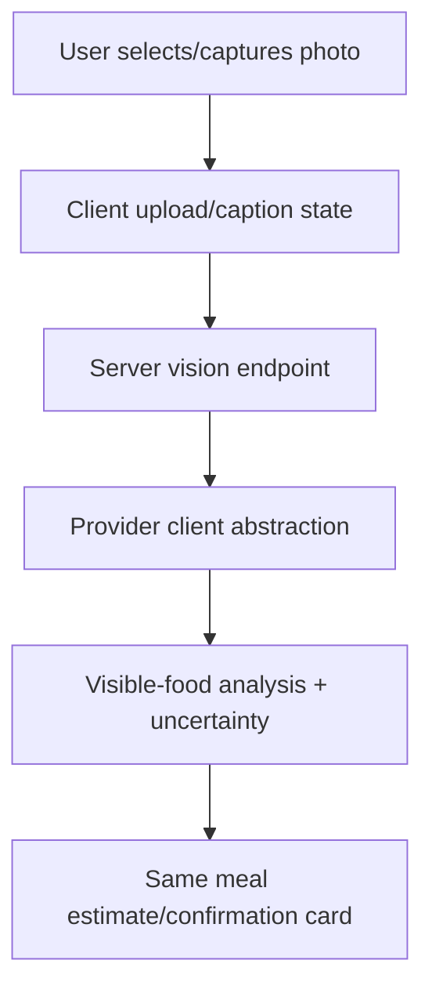

# Meal Estimate Lifecycle

Status: implemented for the text/chat estimate path; voice and photo are documented target flows and must use the same canonical estimate boundary when implemented.

## Root-cause fixed in this slice

The screenshot bug happened because the assistant prose and the confirmation card were not strongly tied to the same structured nutrition object. The LLM could describe the rich breakfast correctly, while the deterministic baseline only recognized a tiny food vocabulary and produced a stale/weak confirmation payload such as `roti` with 96–144 kcal.

This slice reduces that class of bug by expanding the typed nutrition parser and making the confirm card use the same deterministic structured item details, kcal range, macros, serving labels, and assumptions that are attached to the assistant meal-candidate block. The regression breakfast now parses whey isolate, oats, skyr, chia, flax, dates/honey, almond milk, dragon fruit, mango, and radish kimchi, and explicitly asserts that `roti` does not appear unless present in the user log.

## Current text flow

```mermaid
flowchart TD
  A[User text in Home composer] --> B[/api/chat]
  B --> C[Health coach runtime]
  C --> D[Typed parser + deterministic nutrition baseline]
  C --> E[LLM provider for coach prose + presentation]
  D --> F[meal_log_candidate block]
  E --> F
  F --> G[Assistant message metadata stores candidate block]
  G --> H[Confirmation card renders same candidate]
  H --> I[Looks right posts candidate id + selected slot/date]
  I --> J[/chat/confirm loads assistant metadata]
  J --> K[confirmMealEstimate persists canonical kcal/macros/items for target local date]
  K --> L[Home daily totals refresh from confirmed meals]
```

## Confirmation invariants

- The card must render from the `meal_log_candidate` block returned by `/api/chat`.
- The confirm form sends the assistant message/candidate id plus user-selected meal slot and target local date, not free-text nutrition fields.
- `/chat/confirm` reloads the candidate metadata server-side for the authenticated user and applies only validated slot/date overrides.
- Confirmed meals persist only after explicit user confirmation.
- Unconfirmed candidates do not affect Home/Today totals.
- Corrections should update the pending candidate before confirmation. Oily, fried, sauce-heavy, ghee, butter, or restaurant-style corrections should not lower calories/fat unless the user also reduces portion size.
- Daily macro/micro total questions are summary intent, not meal-estimate intent, and must not create or resurrect a confirmation card.
- Late-night logs that mention “yesterday”, “previous day”, or “last night” seed `targetLocalDate` to the previous IST date; the card exposes an editable Log date before saving.

## Daily local-date aggregation

The repo currently uses IST helpers for the Home/Today query. Confirmed chat estimates can now carry an explicit `targetLocalDate`; when present, `confirmMealEstimate` writes a representative UTC `logged_at` for that IST calendar day (for example dinner uses 21:00 IST). The broader product requirement is still to use each user's IANA timezone, store UTC timestamps, and store/query an explicit local date. That full schema is not implemented in this slice and remains tracked as follow-up work.

Target rules:

- Store `logged_at` in UTC.
- Store or derive `timezone` per log from the user's profile/device.
- Store/query `local_date` as `YYYY-MM-DD` for the user's timezone.
- Home/Today shows the selected local day only.
- Trends keeps historical totals.

## Voice transcription target flow

```mermaid
flowchart TD
  A[User taps mic] --> B[Client MediaRecorder]
  B --> C[POST audio FormData to server]
  C --> D[Server-only ElevenLabs STT client]
  D --> E[Editable transcript]
  E --> F[/api/chat text estimate path]
```

Voice must not expose provider keys in browser code. Permission denial, recording, processing, transcribed, and failed states should use calm recovery copy.

## Photo analysis target flow



Photo analysis must return the same structured estimate shape as text/voice. It should identify visible foods, approximate portions, preparation cues, and uncertainty without moralizing.

## Provider-call boundary

Provider calls belong in the repo-approved AI client/provider layer (`src/lib/openai/client.ts`, `src/lib/claude/client.ts`, and `src/lib/agents/health-coach/llmProvider.ts`). UI components and route handlers should not scatter direct SDK calls or hold provider secrets.

## Manual QA checklist

1. Log the regression breakfast text from `src/lib/nutrition/pipeline.test.ts`.
2. Confirm the assistant and card show the same items and no `roti`.
3. Confirm the kcal/macro values in the card match the values that save; the card headline should show a best-guess kcal with the range underneath.
4. Press `Enter` in the desktop composer and verify it sends.
5. Press `Shift+Enter` and verify it does not send.
6. Correct a pending estimate with “slightly oily” and verify the card is refreshed with calories/fat held or increased before saving.
7. Ask “What are my totals on macros and micros for the day vs DVA?” and verify no meal card opens; use the sticky daily totals pill to open the DV/details sheet.
8. Confirm a meal and verify Home totals update only after confirmation.
9. After midnight IST, log “previous day dinner was …”, verify the card Log date is yesterday, confirm it, then open `/today?date=YYYY-MM-DD` for yesterday and verify the meal appears there rather than today.
10. Open the next local day and verify older meals remain in Trends/history rather than today's total once full local-date storage is implemented.
11. For future voice/photo slices: record audio/select photo, verify transcript/analysis, and confirm the same card path is used.
